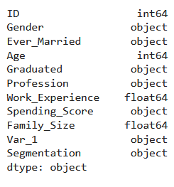
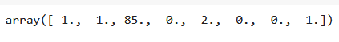

# Developing a Neural Network Classification Model

## AIM

To develop a neural network classification model for the given dataset.

## Problem Statement

An automobile company has plans to enter new markets with their existing products. After intensive market research, they’ve decided that the behavior of the new market is similar to their existing market.

In their existing market, the sales team has classified all customers into 4 segments (A, B, C, D ). Then, they performed segmented outreach and communication for a different segment of customers. This strategy has work exceptionally well for them. They plan to use the same strategy for the new markets.

You are required to help the manager to predict the right group of the new customers.

## Neural Network Model


## DESIGN STEPS
### Step 1:
Load the dataset, clean it by dropping missing values, encode categorical variables, and remove unnecessary columns.
### Step 2:
Visualize data relationships using correlation matrices, pairplots, distribution plots, count plots, box plots, and scatter plots.
### Step 3:
Extract features and target variables, split the dataset into training and testing sets, one-hot encode the target variable, and scale numerical features.
### Step 4:
Construct a neural network model with appropriate architecture, compile it with suitable loss and optimization functions, and train the model on the training set with specified epochs and batch size.
### Step 5:
Evaluate the trained model's performance using test data, save the model using Keras, and store necessary data (scaled features, encoders, etc.) using pickle for future use.


## PROGRAM

### Name: Sowmiya N
### Register Number: 212221230106

```
import pandas as pd
from sklearn.model_selection import train_test_split
from tensorflow.keras.models import Sequential
from tensorflow.keras.models import load_model
import pickle
from tensorflow.keras.layers import Dense
from tensorflow.keras.layers import Dropout
from tensorflow.keras.layers import BatchNormalization
import tensorflow as tf
import seaborn as sns
from tensorflow.keras.callbacks import EarlyStopping
from sklearn.preprocessing import MinMaxScaler
from sklearn.preprocessing import LabelEncoder
from sklearn.preprocessing import OneHotEncoder
from sklearn.preprocessing import OrdinalEncoder
from sklearn.metrics import classification_report,confusion_matrix
import numpy as np
import matplotlib.pylab as plt

customer_df = pd.read_csv('customers.csv')
customer_df

# DATA EXPLORATION 
customer_df.columns
customer_df.dtypes
customer_df.shape
customer_df.isnull().sum()
customer_df_cleaned = customer_df.dropna(axis=0)
customer_df_cleaned.isnull().sum()
customer_df_cleaned = customer_df.dropna(axis=0)
customer_df_cleaned.isnull().sum()
customer_df_cleaned.shape
customer_df_cleaned.dtypes

customer_df_cleaned['Gender'].unique()
customer_df_cleaned['Ever_Married'].unique()
customer_df_cleaned['Graduated'].unique()
customer_df_cleaned['Profession'].unique()
customer_df_cleaned['Spending_Score'].unique()
customer_df_cleaned['Var_1'].unique()
customer_df_cleaned['Segmentation'].unique()

categories_list=[['Male', 'Female'],
           ['No', 'Yes'],
           ['No', 'Yes'],
           ['Healthcare', 'Engineer', 'Lawyer', 'Artist', 'Doctor',
            'Homemaker', 'Entertainment', 'Marketing', 'Executive'],
           ['Low', 'Average', 'High']
           ]
enc = OrdinalEncoder(categories=categories_list)

customers_1 = customer_df_cleaned.copy()
customers_1[['Gender',
             'Ever_Married',
              'Graduated','Profession',
              'Spending_Score']] = enc.fit_transform(customers_1[['Gender',
                                                                 'Ever_Married',
                                                                 'Graduated','Profession',
                                                                 'Spending_Score']])
customers_1.dtypes
le = LabelEncoder()
customers_1['Segmentation'] = le.fit_transform(customers_1['Segmentation'])
customers_1.dtypes

customers_1 = customers_1.drop('ID',axis=1)
customers_1 = customers_1.drop('Var_1',axis=1)
customers_1.dtypes

# Calculate the correlation matrix
corr = customers_1.corr()
# Plot the heatmap
sns.heatmap(corr, 
        xticklabels=corr.columns,
        yticklabels=corr.columns,
        cmap="BuPu",
        annot= True)

sns.pairplot(customers_1)
sns.distplot(customers_1['Age'])
plt.figure(figsize=(10,6))
sns.countplot(customers_1['Family_Size'])
plt.figure(figsize=(10,6))
sns.boxplot(x='Family_Size',y='Age',data=customers_1)

plt.figure(figsize=(10,6))
sns.scatterplot(x='Family_Size',y='Spending_Score',data=customers_1)

plt.figure(figsize=(10,6))
sns.scatterplot(x='Family_Size',y='Age',data=customers_1)

customers_1.describe()

customers_1['Segmentation'].unique()
X=customers_1[['Gender','Ever_Married','Age','Graduated','Profession','Work_Experience','Spending_Score','Family_Size']].values

y1 = customers_1[['Segmentation']].values

one_hot_enc = OneHotEncoder()

one_hot_enc.fit(y1)
y= one_hot_enc.transform(y1).toarray()
y1.shape
y.shape
y1[0]
y[0]

X.shape
X_train,X_test,y_train,y_test=train_test_split(X,y,
                                               test_size=0.33,
                                               random_state=50)
                                    
X_train[0]
X_train.shape
scaler_age = MinMaxScaler()
scaler_age.fit(X_train[:,2].reshape(-1,1))

X_train_scaled = np.copy(X_train)
X_test_scaled = np.copy(X_test)
# To scale the Age column
X_train_scaled[:,2] = scaler_age.transform(X_train[:,2].reshape(-1,1)).reshape(-1)
X_test_scaled[:,2] = scaler_age.transform(X_test[:,2].reshape(-1,1)).reshape(-1)

Model = Sequential ([
    Dense(units = 3, activation ='relu', input_shape = [8]),
    Dense(units = 2, activation ='relu'),
    Dense(units=4,activation = 'softmax')
])

Model.compile(optimizer='adam',
                 loss= 'categorical_crossentropy',
                 metrics=['accuracy'])

Model.fit(x=X_train_scaled,y=y_train,
             epochs= 2000,
             batch_size=256,
             validation_data=(X_test_scaled,y_test),
             )

metrics = pd.DataFrame(Model.history.history)
metrics.head()
metrics[['loss','val_loss']].plot()

x_test_predictions = np.argmax(Model.predict(X_test_scaled), axis=1)
x_test_predictions.shape
y_test_truevalue = np.argmax(y_test,axis=1)
y_test_truevalue.shape
print(confusion_matrix(y_test_truevalue,x_test_predictions))
print(classification_report(y_test_truevalue,x_test_predictions))

# Saving the Model
Model.save('customer_classification_model.h5')
# Saving the data
with open('customer_data.pickle', 'wb') as fh:
   pickle.dump([X_train_scaled,y_train,X_test_scaled,y_test,customers_1,customer_df_cleaned,scaler_age,enc,one_hot_enc,le], fh)
# Loading the Model
Model = load_model('customer_classification_model.h5')
# Loading the data
with open('customer_data.pickle', 'rb') as fh:
   [X_train_scaled,y_train,X_test_scaled,y_test,customers_1,customer_df_cleaned,scaler_age,enc,one_hot_enc,le]=pickle.load(fh)

x_single_prediction = np.argmax(Model.predict(X_test_scaled[1:2,:]), axis=1)

print(x_single_prediction)
print(le.inverse_transform(x_single_prediction))
```

## Dataset Information
#### Dataset : 

#### Columns of the dataset :

#### Type of the Columns in the dataset :

#### Shape of the Dataset (Row,Column) : 

#### Sum of Null Values :

#### After droping Null Values :

#### Shape of the Dataset after removing null values :

#### Data Type of Columns:

#### Unique values present in the columns :

#### Data Type of columns after applying Ordinal Encoder : 

#### Data type of column "Segmentation" after applying Label encoder :

#### After removing column "ID" and "Var_1" :

#### Data Exploration:
#### HeatMap : 

#### PairPlot :

#### Distplot :

#### Count Plot :

#### Box Plot :

#### Scatter Plot  "Family_Size" vs "Spending_Score": 

#### Scatter Plot  "Family_Size" vs "Age": 

#### Dataset after coverting categorical values into numerical values :

#### Unique value of the column "Segmentation" : 

#### Applying ordinal encoder to the output column "Segementation" : 

#### Shape after applying ordinal encoder :

#### Shape after applying Onehot Enocoder :


## OUTPUT
### Training Dataset - X_train : 


### Model Fiting :

### Training Loss, Validation Loss Vs Iteration Plot


### Classification Report


### Confusion Matrix

### New Sample Data Prediction


## RESULT
A neural network classification model for the given dataset is developed.
